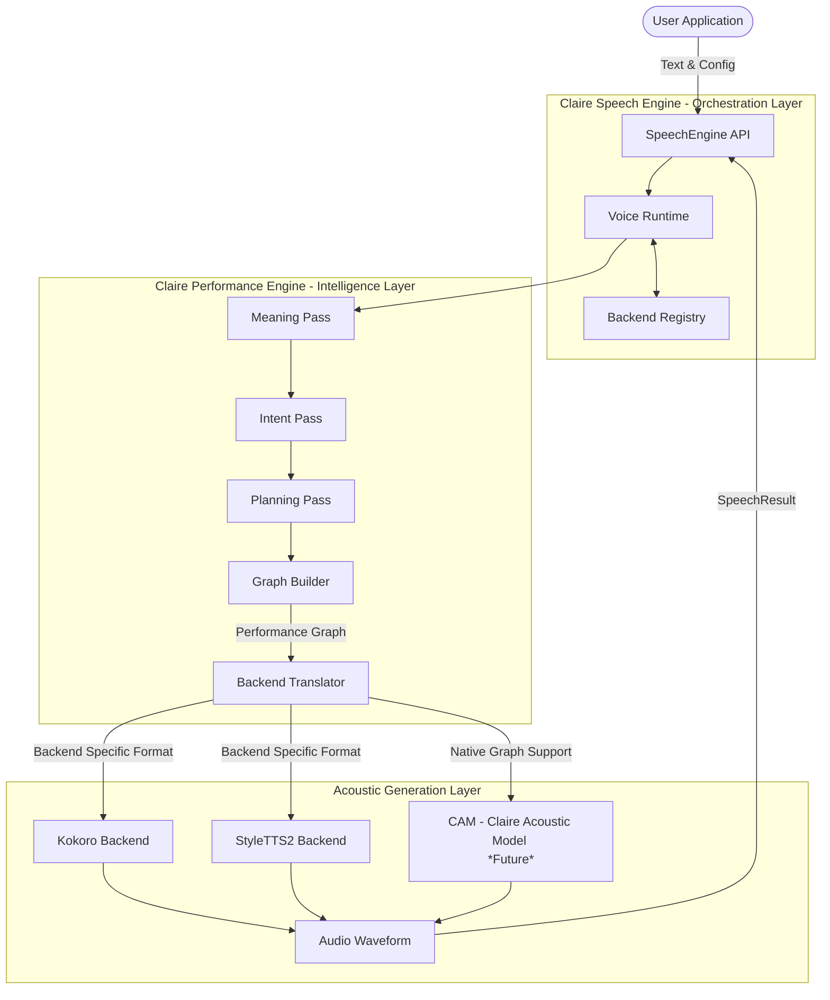
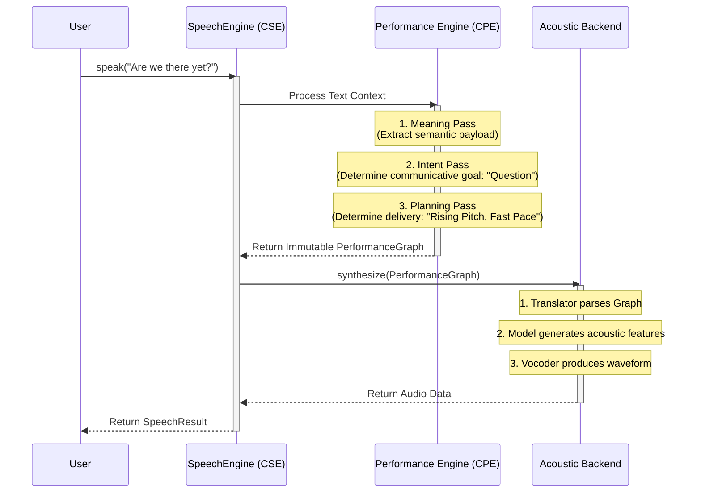

# Claire Speech Engine (CSE) Architecture

This document provides a high-level, visual overview of the Claire Speech Engine (CSE) architecture. CSE is designed to be a highly modular, three-tier system that completely separates the orchestration of speech from the communicative intelligence and the actual acoustic generation.

## High-Level Architecture

The framework is divided into three major architectural boundaries:

1. **CSE (Orchestration & API):** The outer shell. Manages configuration, lifecycle, backends, and API surfaces.
2. **CPE (Claire Performance Engine):** The brain. Responsible for semantic reasoning, communicative intent, and performance planning.
3. **Acoustic Backends (e.g., CAM, Kokoro, StyleTTS2):** The vocal cords. Responsible for turning the abstract performance plans into actual audio waveforms.

## The Data Flow: Text to Audio

The core philosophy of CSE is that **text is not audio**. Text must be *interpreted* into a performance, and then that performance is synthesized into audio.

## Core Components Explained

### 1. `SpeechEngine` (CSE)
The `SpeechEngine` is the primary public entry point for applications integrating CSE. It provides a clean, stable API facade over the internal complexity of the framework. Developers interact almost exclusively with this class to load voices, switch backends, and trigger synthesis.

### 2. Claire Performance Engine (CPE)
CPE is the "director" of the voice actor. Instead of passing raw text directly to an AI model, CPE intercepts the text and performs a series of **Reasoning Passes**:
- **Meaning:** What does this text actually mean?
- **Intent:** What is the speaker trying to achieve? (e.g., questioning, demanding, informing).
- **Planning:** How should the voice actor physically perform this? (e.g., pitch contour, pacing, emphasis).

CPE produces an immutable, backend-agnostic **Performance Graph**.

### 3. Acoustic Backends
The `AcousticBackend` is an abstract interface that defines how the engine interacts with speech models. 
- **External Models (Kokoro, StyleTTS2):** These models were not trained natively on the CPE Performance Graph. They rely on a **Translator** inside their CSE integration package to parse the graph and do their best to approximate the requested performance.
- **CAM (Claire Acoustic Model):** This is the future, purpose-built acoustic model for this project. Unlike Kokoro or StyleTTS2, CAM will be trained *specifically* to consume the rich nodes of the Performance Graph directly, allowing for unparalleled expressive control.

## `SpeechResult`
A `SpeechResult` is the immutable output object returned to the user upon successful (or failed) synthesis. It encapsulates:
- The generated audio data.
- Success status and error messages.
- Performance metrics (e.g., time-to-first-byte, total generation time).
