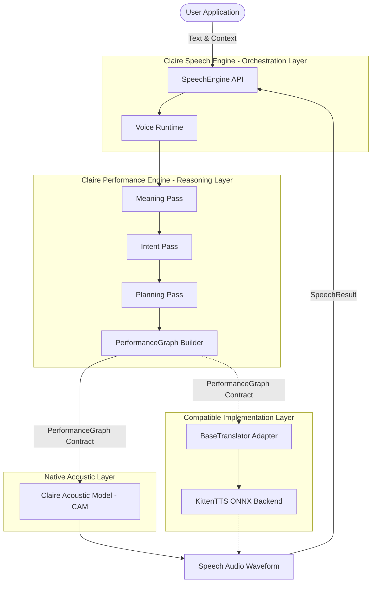
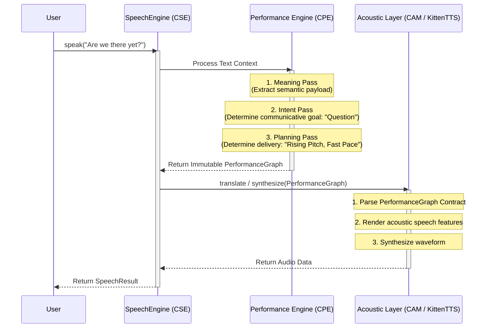

# Claire Speech Engine (CSE) Architecture

This document provides a high-level, visual overview of the Claire Speech Engine (CSE) architecture. CSE is designed to be a three-tier system that completely separates the orchestration of speech from communicative intelligence and acoustic generation.

## High-Level Architecture

The system is structured around three primary architectural layers:

1. **CSE (Complete Engine & Orchestration):** Coordinates system lifecycle, voice registry, audio transport, and public API surfaces.
2. **CPE (Claire Performance Engine):** The communication intelligence layer, responsible for semantic reasoning, communicative intent, and performance planning.
3. **CAM (Claire Acoustic Model):** The native acoustic rendering layer, responsible for synthesizing the `PerformanceGraph` into natural speech.

*(Note: While native CAM is under development, KittenTTS is used as the current compatible acoustic implementation satisfying the `PerformanceGraph` contract via translation.)*

```mermaid
flowchart TD
    User([User Application]) -->|Text & Context| CSE_API

    subgraph CSE [Claire Speech Engine - Orchestration Layer]
        CSE_API[SpeechEngine API]
        Runtime[Voice Runtime]
        CSE_API --> Runtime
    end

    subgraph CPE [Claire Performance Engine - Reasoning Layer]
        Meaning[Meaning Pass]
        Intent[Intent Pass]
        Planning[Planning Pass]
        GraphBuilder[PerformanceGraph Builder]
        
        Runtime --> Meaning
        Meaning --> Intent
        Intent --> Planning
        Planning --> GraphBuilder
    end

    subgraph NativeAcoustics [Native Acoustic Layer]
        CAM[Claire Acoustic Model - CAM]
    end

    subgraph CompatibleAcoustics [Compatible Implementation Layer]
        Translator[BaseTranslator Adapter]
        KittenTTS[KittenTTS ONNX Backend]
        Translator --> KittenTTS
    end

    GraphBuilder -->|PerformanceGraph Contract| CAM
    GraphBuilder -.->|PerformanceGraph Contract| Translator
    
    CAM --> Audio[Speech Audio Waveform]
    KittenTTS -.-> Audio
    
    Audio -->|SpeechResult| CSE_API
```

## The Data Flow: Text to Audio

The core philosophy of CSE is that **text is not audio**. Text must be *interpreted* into communicative performance, and then that performance is synthesized into speech.

```mermaid
sequenceDiagram
    participant User
    participant CSE as SpeechEngine (CSE)
    participant CPE as Performance Engine (CPE)
    participant CAM as Acoustic Layer (CAM / KittenTTS)

    User->>CSE: speak("Are we there yet?")
    activate CSE
    
    CSE->>CPE: Process Text Context
    activate CPE
    
    Note over CPE: 1. Meaning Pass<br/>(Extract semantic payload)
    Note over CPE: 2. Intent Pass<br/>(Determine communicative goal: "Question")
    Note over CPE: 3. Planning Pass<br/>(Determine delivery: "Rising Pitch, Fast Pace")
    
    CPE-->>CSE: Return Immutable PerformanceGraph
    deactivate CPE
    
    CSE->>CAM: translate / synthesize(PerformanceGraph)
    activate CAM
    
    Note over CAM: 1. Parse PerformanceGraph Contract
    Note over CAM: 2. Render acoustic speech features
    Note over CAM: 3. Synthesize waveform
    
    CAM-->>CSE: Return Audio Data
    deactivate CAM
    
    CSE-->>User: Return SpeechResult
    deactivate CSE
```

## Core Components Explained

### 1. `SpeechEngine` (CSE)
The `SpeechEngine` is the primary public entry point for applications integrating CSE. It provides a clean, stable API facade over the internal complexity of the engine. Developers interact with this class to load voices, initialize the runtime, and trigger speech generation.

### 2. Claire Performance Engine (CPE)
CPE is the communication intelligence layer. Instead of passing raw text directly to an acoustic model, CPE analyzes the text and optional character state through sequential **Reasoning Passes**:
- **Meaning:** What does this text literally communicate?
- **Intent:** What communicative goal is being pursued? (e.g., question, exclamation, statement).
- **Planning:** How should the voice deliver this? (e.g., pitch contour, pacing, emphasis).

CPE outputs an immutable, backend-independent **PerformanceGraph** that serves as the contract for acoustic rendering.

### 3. Claire Acoustic Model (CAM) & Compatible Implementations
- **CAM (Claire Acoustic Model):** The native, in-house acoustic model of the Claire Project, designed to consume the nodes and attributes of the `PerformanceGraph` directly for expressive speech synthesis.
- **Compatible Implementations (e.g., KittenTTS):** Interim or alternative acoustic engines that consume the `PerformanceGraph` through a `BaseTranslator` adapter to satisfy the CAM contract while native CAM is under development.

## `SpeechResult`
A `SpeechResult` is the immutable output object returned to the user upon successful (or failed) synthesis. It encapsulates:
- The generated audio data and file paths.
- Success status and error messages.
- Performance metrics (e.g., synthesis duration, sample rate).
